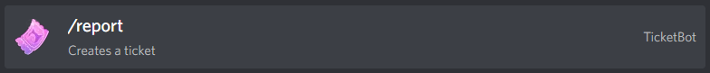
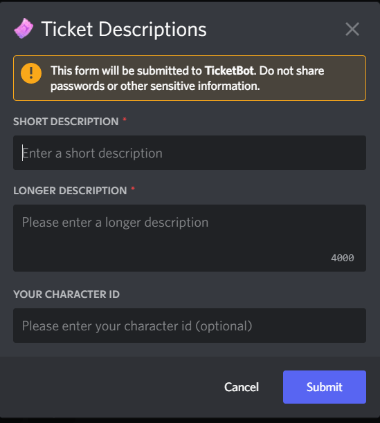
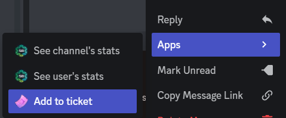

## Tickets

We are tracking issues through tickets. These tickets are shown on discord, and stored in the bot so we can access them easily. Tickets are submitted by you, the players and then handled by the moderation staff of this Discord server. This is not a support ticket service, we can not help you recover accounts, but we use this to communicate with the development team. 

Tickets have a state, indicating how they are picked up. When you create a ticket, it starts out as `Reported` and is hidden from the public. The moderators get a message and can approve a ticket, or mark it as a duplicate to reduce the amount of tickets. We can ask for more information about the bug while approving it though. After approving the ticket, the ticket will appear- in the ticket-channel, with a status of `Registered`. This means we have read the bug, it's not a duplicate. The next step is communication with the development team. If not enough information is available, we might ask for more before we can submit it to the development team, as your ticket will have to be translated. When we ask the development team, the status will be set to `Requested`. We wait for feedback from the development team, and after that we can hopefully change the ticket to `Fixed`, and when it becomes irrelevant we will hide the ticket 

## Creating a ticket

You can create a ticket by typing /report in the appropriate channel. Make sure you select the command

After this, a popup will appear so you can fill in the appropriate information

Make sure you fill in the appropriate information. Keep the short description to a single sentence, and explain your issue in the long description box. This keeps the discord tidy, as by default only the short description will be shown on discord. The character ID will always stay private and is not shown to the public. 

After creating the ticket, the ticket bot will send you a message in private to add images or videos (mind the discord upload limit) to your ticket. To add an image to your ticket, just send the image to the bot in a DM, and a dropdown box will appear with your tickets. You can then pick one of the tickets and the image will be added

## Ticket Discussion

Certain tickets can need some discussion. In that case, keep the discussion on a thread on the ticket. This thread will automatically be created when the ticket gets approved by a moderator. If the status of a ticket changes, a notification will be sent in the thread that goes with the ticket discussion.

## Ticket Details

All tickets get a button to show the details for a ticket. The details include the longer description and the state history (when tickets got reported, approved etc). It will also show the response from the devs once something has been fixed

## Adding images to your ticket

If the ticket is not approved by a moderator yet, there is no post about it yet in the discord server. To add an image, you can DM the image to the bot (the bot should have messaged you when you created the ticket), and select the report it goes with.

After the ticket got approved, you can either DM the image, or post it in the thread. After you posted the image in the thread that goes with your ticket, you need to rightclick it, and select 'apps', and then 'add to ticket'. Only the author of the ticket, and the moderators can do this, but you can also add other people's images this way.

